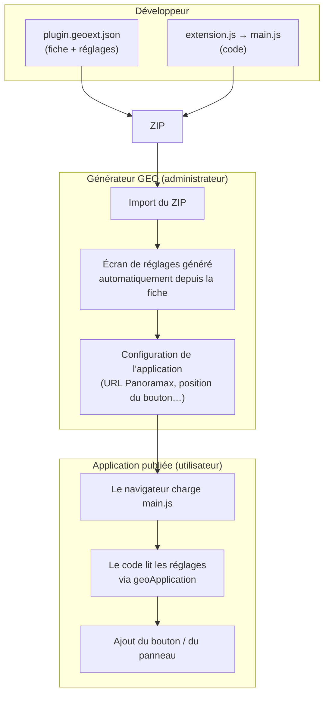

# geo-panoramax — Comprendre un module GEO (version simple)

Ce module affiche un visualiseur de photos de rue [Panoramax](https://docs.panoramax.fr/) dans une application GEO. Quand on clique sur la carte, il affiche la photo la plus proche. Ce README explique aussi **comment fonctionne n'importe quel module GEO** et comment il s'articule avec le **Générateur GEO**.

> Pour le détail technique de ce module : [`GUIDE-DEV.md`](GUIDE-DEV.md).

---

## 1. Un module, c'est quoi ?

Un **ZIP** qui contient deux choses obligatoires :

| Fichier | Rôle |
|---|---|
| `plugin.geoext.json` | La **fiche d'identité** : nom, version, dépendances, et la liste des **réglages** que l'administrateur remplira dans le Générateur |
| `main.js` | Le **code** du module, exécuté dans le navigateur quand l'application GEO s'ouvre |

On importe le ZIP dans le Générateur, on le glisse dans une application, et il s'exécute dans la page.

---

## 2. Comment tout s'articule avec le Générateur GEO



En clair :

1. **Le développeur décrit les réglages** dans `plugin.geoext.json` (texte, nombre, case à cocher, liste de choix, choix d'une couche ou d'une recherche GEO…).
2. **Le Générateur fabrique tout seul l'écran de réglage** correspondant : aucun code d'interface à écrire pour ça.
3. **L'administrateur remplit les réglages** par application (ici : l'URL de l'instance Panoramax, la position du bouton…).
4. **À l'exécution**, le code du module relit ces réglages et s'en sert.

---

## 3. Où est le code ?

Tout se passe dans **`src/js/extension.js`**. Il déclare un module **Angular** et reçoit `geoApplication`, l'objet qui donne accès à la carte, aux couches et aux recherches :

```js
angular
  .module(pluginConf.code.moduleName, pluginConf.code.dependencies)
  .run(['geoApplication', function (geoApplication) {

    geoApplication.executeWhenInitialized(function () {
      // 1. lire les réglages saisis dans le Générateur
      var config = geoApplication.getConfigurationByExtensionKey(pluginConf.name);
      // 2. ... et utiliser la carte en toute sécurité
    });

    geoApplication.watch('components', function () {
      // 3. ajouter le bouton / le panneau (une seule fois)
    });
  }]);
```

Trois règles à retenir :

- **Ne toucher à la carte qu'une fois l'application prête** (`executeWhenInitialized`). Avant, rien n'est disponible.
- **N'enregistrer le bouton qu'une seule fois** (un drapeau `_registered`).
- **Écrire l'injection Angular en notation tableau** (`['geoApplication', function …]`), sinon la minification casse le module.

Pour geo-panoramax, la logique métier est dans `extension.js` : il pose le composant `<pnx-viewer>` dans un panneau, écoute les clics sur la carte GEO, demande à l'API Panoramax la photo la plus proche, puis affiche un marqueur sur la carte. La recherche des photos elle-même est faite par le **serveur Panoramax**, pas par le module.

---

## 4. Organisation du dossier

```
geo-panoramax/
├── src/plugin.geoext.json      fiche d'identité + réglages
├── src/js/extension.js         le code
├── src/preview.png             vignette dans le Générateur
├── webpack.config.js           assemble le code en un seul main.js
├── scripts/package.js          fabrique le ZIP
├── webpack.publish.config.js   envoie le module directement au serveur GEO
└── lib/                        emplacement (local) du plugin de publication Business Geografic, voir `lib/README.md`
```

Angular est **fourni par GEO** : il n'est pas embarqué dans `main.js`.

---

## 5. Cycle de développement

```bash
npm install          # une fois
npm run watch        # développement : recompile à chaque modification
npm run build        # production → dist/main.js
npm run package      # build + ZIP prêt à importer
npm run publish      # envoi direct au serveur GEO : non fonctionnel avec ce module, voir ci-dessous
```

1. Modifier `plugin.geoext.json` et/ou `extension.js`.
2. `npm run package`.
3. Dans le Générateur (⚠️ **ancienne interface** de GEO, pas la nouvelle) : menu **Modules** > **+ Module**, importer le ZIP.
4. Glisser le module dans l'application (via le « Module GEO API JS v2 »), configurer ses réglages, enregistrer.
5. Ouvrir l'application, tester, regarder la console du navigateur (F12) en cas de souci.
6. Corriger, recommencer.

> ⚠️ `npm run publish` renvoie une **erreur 500 du serveur GEO** avec ce module (constatée lors d'un test ; cause probable non confirmée : le bundle fait ~2,9 Mo, contre quelques Ko pour un module classique, et le plugin l'envoie en un seul champ de formulaire). **Importer le ZIP à la main** dans le Générateur est la méthode recommandée.

Pour tout de même essayer `npm run publish`, installer d'abord le plugin de publication de Business Geografic (non distribué avec ce dépôt, voir [`lib/README.md`](lib/README.md)), puis définir `GEO_SERVER` et `GEO_ACCESS_TOKEN` (jeton d'accès avec le scope `geo:aas`). **Ne jamais écrire le jeton en dur dans le code.**

---

## 6. Pièges courants

- **GEO échoue souvent en silence** : ajouter ses propres `console.error` dans les branches de repli.
- **Des données ne sont prêtes qu'après le démarrage** de l'application : les lire au moment de l'usage (ouverture du panneau), pas à l'enregistrement.
- **Dans une application déployée, `window.geo` n'expose pas l'API GEO** : on ne peut pas créer de sous-application `geo.application(...)`. Pour une carte secondaire, utiliser OpenLayers (`window.ol`) directement.
- **Bibliothèque npm trop récente pour webpack 4** (cas du viewer Panoramax) : ajouter des plugins Babel ciblés sur cette seule dépendance.
- **Panoramax** : l'URL de l'instance doit se terminer par `/api`, et il ne faut pas poser l'attribut `focus` en dur sur `<pnx-viewer>` (erreur `Map is not enabled`).
- **Noms d'attributs tronqués à 28 caractères** dans les résultats de recherche GEO.
- **Listes de choix (`ENUMERATED`) : le Générateur affiche les `values` et ignore `labels`** (testé en 4.5.0). Mettre le texte lisible directement dans `values` et le convertir dans le code.

---

## 7. Aller plus loin

- Doc officielle des modules : <https://docgeoapi.business-geografic.com/fr/guide/4-Modules/introduction>
- Template de module préconfiguré (webpack + plugin de publication) : <https://docgeoapi.business-geografic.com/fr/guide/4-Modules/download>

> Les pages de téléchargement ci-dessus ne sont accessibles qu'aux utilisateurs de GEO Générateur disposant du module GEO API JS v2.

---

## 8. Piste d'évolution : pointer un objet depuis la photo (non réalisée)

**Idée** : en cliquant (et en zoomant) sur la photo Panoramax, poser sur la carte GEO un point géolocalisé en déduisant sa position de la photo, pour relever une grille, un regard d'assainissement, un candélabre, etc. Étudiée le 2026-10-09 ; **rien n'est implémenté ni testé sur de vraies photos**.

Un clic donne une direction (un rayon partant de la caméra), pas un point. Trois façons de le compléter :

| Méthode | Ingrédients | Précision typique |
|---|---|---|
| **A. Projection sur le sol** (1 photo) | hauteur de la caméra, ou altitude de la photo moins altitude du terrain | ~0,2 à 1 m à 10 m |
| **B. Triangulation** (2 photos) | même objet cliqué sur deux photos de la séquence | meilleure, indépendante de la hauteur de caméra |
| **C. Rayon contre le LiDAR HD** | nuage de points de la dalle | décimétrique au sol |

La précision absolue reste plafonnée par le GPS de la photo (5 m déclarés sur un smartphone). Conception envisagée, limites et questions à trancher avant de commencer : voir [`GUIDE-DEV.md`](GUIDE-DEV.md#piste-dévolution--pointer-un-objet-depuis-la-photo-non-réalisée).

---

## 9. Licence et mentions

- Ce module est publié sous licence **GNU AGPL-3.0 ou ultérieure** : voir [`LICENSE`](LICENSE).
- Il embarque [Shepherd.js](https://shepherdjs.dev/) (AGPL-3.0, ou licence commerciale par ailleurs), [`@panoramax/web-viewer`](https://gitlab.com/panoramax/server/api) (MIT) et des icônes [Lucide](https://lucide.dev) (ISC).
- Il s'exécute dans une application **GEO** (Business Geografic) mais n'en contient ni le code ni la documentation. « GEO » et « Business Geografic » sont des marques de leurs détenteurs ; ce projet n'est ni affilié à, ni soutenu par Business Geografic.
- Le plugin de publication `@bg/publish-js-extension` est propriétaire et **n'est pas inclus** dans ce dépôt.
